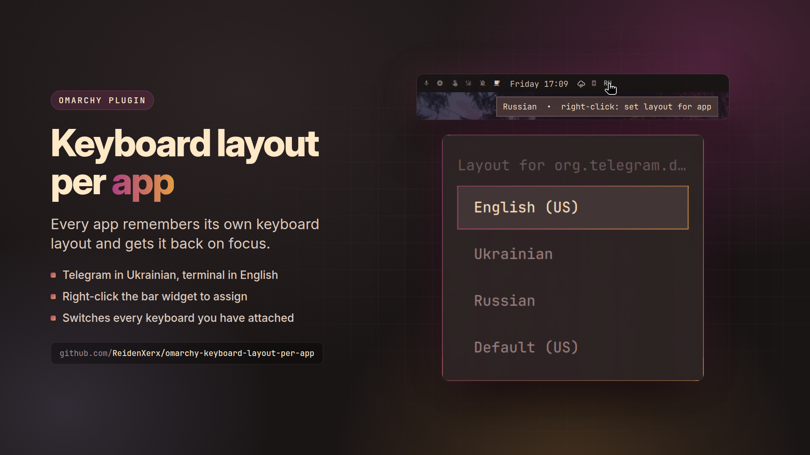

# Keyboard layout per app



An [Omarchy](https://omarchy.org) bar widget that remembers the **keyboard layout per
application** and restores it when you focus that app.

Type Ukrainian in Telegram and English in your terminal, and stop switching by hand. KDE and
Windows both behave this way; Hyprland has a single global layout, so this supplies the
memory.


## Install

```bash
omarchy plugin add https://github.com/ReidenXerx/omarchy-keyboard-layout-per-app.git --enable
```

Requires more than one layout in `kb_layout` — the widget hides itself otherwise:

```lua
-- ~/.config/hypr/input.lua
hl.config({ input = {
  kb_layout = "us,ua,ru",
  kb_options = "compose:caps,shift:both_capslock_cancel",
}})
```

## Use

| action | result |
|---|---|
| **left-click** the widget | next layout, on every keyboard at once |
| **right-click** the widget | pick an app, then a layout |
| focus an app | its remembered layout is restored |
| switch layout while an app is focused | that becomes the app's layout |
| unassigned apps | first layout in `kb_layout` (index 0) |

Assignments live in `~/.config/omarchy/kb-layout-per-app.json` — plain JSON, hand-editable,
re-read on every focus, so edits apply with no restart.

```bash
bin/kb-layout-assign            # the picker (same as right-click)
bin/kb-layout-assign list
bin/kb-layout-assign set foot Ukrainian
bin/kb-layout-assign clear foot
```

The app picker lists running windows *and* installed applications, so an app can be assigned
before it is ever opened — including tray-only ones.

## How it works, and why it looks like this

`bin/kb-layout-daemon` tails Hyprland's event socket, applying a layout on `activewindow`
and recording one when the seat's layout changes. The widget starts it via
`Process { running: true }`, and again if it ever exits, rather than an autostart entry: a
plugin cannot edit someone's hypr config, and tying the daemon to the shell means it stops
cleanly too.

Details that are easy to get wrong, each of which broke real use:

- **Layout is per input DEVICE, and an input method adds one.** A laptop can expose ten
  keyboard devices (lid switch, power button, hotkeys...), and fcitx5 injects keys through a
  virtual keyboard of its own, copying onto it the layout of the keyboard it grabbed. That
  copy is the layout text actually comes out in. Switching the devices one request at a
  time let fcitx5 copy the first device's new layout before the loop reached its keyboard,
  and the loop then advanced it again: Ukrainian on every real keyboard and on the label,
  Russian in the text, and Russian recorded. So every change is one
  `switchxkblayout all <index>` request, which Hyprland finishes before anything else runs.
- **`activelayout` is not a choice.** Applying a layout, a reload recompiling the keymap, a
  keyboard being plugged in, and the input method's keyboard following along all emit it.
  Events only prompt a reading of the seat. A physical keyboard that has left the layout the
  daemon last set is a choice. A keyboard that just appeared, or a reload, is put back on the
  app's layout instead, and virtual keyboards are ignored.
- **Layout names come from xkbcommon, not from switching.** Assignments are stored by name
  ("Ukrainian"); `xkbcli compile-keymap` gives each name's index in the configured
  `kb_layout`, from the same library Hyprland uses. Finding names by cycling a keyboard
  through every layout produced exactly the events the daemon records.
- **Unassigned apps get layout INDEX 0**, the first in `kb_layout`.

Keyed by window **class**, so a second window of the same app inherits the choice.

### A keybinding

Bind a key to the same one-request switch, so a key can never split the seat either:

```lua
-- ~/.config/hypr/bindings.lua
o.bind("ALT + Shift_L", "Switch keyboard layout", "hyprctl switchxkblayout all next")
```

## Security

The plugin runs as you, next to other processes that also run as you, so it does not trust
what it reads or the paths it writes:

- **No shell, no PATH.** The widget starts only its own helpers, as
  `/usr/bin/python3 <plugin>/bin/…`. The helpers run `xkbcli`, `omarchy-menu-select` and
  `omarchy-notification-send` by absolute path, only if they are root-owned and not
  writable by others (`bin/plugin_safety.py`, shared by the ReidenXerx plugins). Children
  get `PATH=/usr/bin`, a deadline, an output ceiling (xkbcli 2 MB listing / 4 MB keymap,
  menus 64 KB) and a whole-process-group kill, and run under `/usr/bin/timeout` so they die
  even if their helper is killed.
- **Hyprland's sockets, checked.** Requests go straight to Hyprland's control socket rather
  than through `hyprctl`. Both sockets are reached from `$XDG_RUNTIME_DIR` one path
  component at a time without following symlinks, only if every directory and the socket
  belong to you, and connected through the checked descriptor. Every reply is capped at
  256 KB with a 3 s deadline.
- **Bounded output to QML.** `kb-layout-assign devices` prints at most 64 keyboards and only
  the four fields the widget reads; `layouts` prints only the lines the label table uses. The
  widget refuses readings over 512 KB. A stuck helper gets SIGTERM from the watchdog (it then
  kills everything it started) and SIGKILL 1.5 s later.
- **Bounded events.** The daemon reads Hyprland's event socket, opened without following
  symlinks, through a 4 KB-per-event, 64 KB-total buffer, dropping oversized events. Window
  classes and layout names over 256 characters or with control characters are never stored.
  At most 500 apps are remembered; past that a new app is refused and logged, never evicted.
  The daemon exits with the shell that started it.
- **Safe file handling.** The assignments file is read with a 128 KB cap and only if it is
  a regular file you own, reached without symlinks. Writes go to a random `O_EXCL`
  temporary file in the same directory, are fsynced and renamed over the destination. If the
  file is unreadable or not valid JSON, the plugin leaves it alone rather than overwrite it.
  The menu installer follows the same rules and never writes a side `.bak` file.

Tests: `python3 tests/helpers_test.py`, `python3 tests/memory_test.py` and
`node tests/model-test.js`.

## Credits

`KeyboardLayoutModel.js` and the widget's layout-querying logic come from Omarchy's built-in
`omarchy.keyboard-layout` widget by David Heinemeier Hansson, MIT licensed. This plugin adds
the per-application memory, the picker, and the daemon.

## Menu entries

Optional Omarchy menu routes (assign, list, clear):

```bash
bin/kb-layout-menu-install          # add them
bin/kb-layout-menu-install remove   # take them out
```

It writes only between its own marker comments in
`~/.config/omarchy/extensions/omarchy-menu.jsonc` and rolls back rather than leaving that
file unparseable.

## Remove

```bash
bin/kb-layout-menu-install remove
omarchy plugin remove reidenxerx.keyboard-layout-per-app
```

Assignments stay in `~/.config/omarchy/kb-layout-per-app.json`; delete it to forget them.
The layout daemon stops with the shell, so nothing is left running.

## License

MIT — see [LICENSE](LICENSE).
